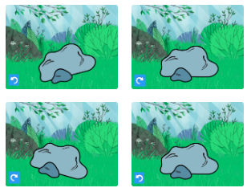

```blocks3
repeat [8]
turn left [15] degrees
wait [0.1] seconds
turn right [15] degrees
wait [0.1] seconds
turn right [15] degrees
wait [0.1] seconds
turn left [15] degrees
wait [0.1] seconds
end
```

